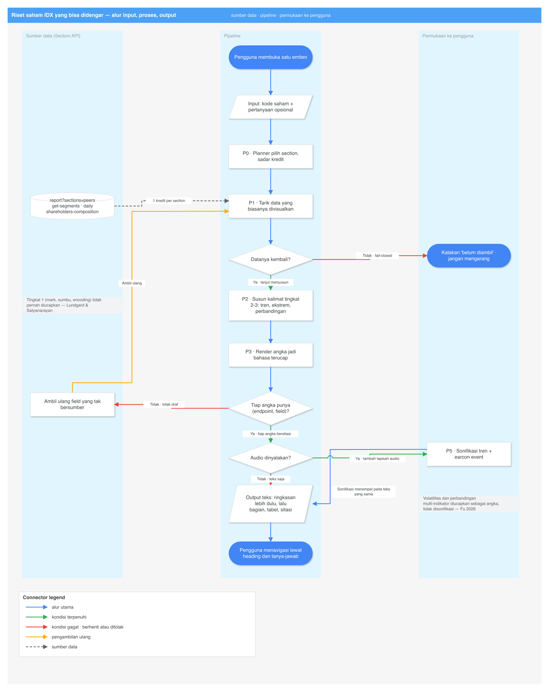

# Akses Non-Visual — dalam bahasa sederhana

Tanggal: 2026-09-09. Pendamping bahasa awam untuk
[`deep-research-akses-non-visual.md`](deep-research-akses-non-visual.md).

Topik ini **berdiri sendiri**. Riset kedua pada sesi yang sama, tentang firewall tip saham, ada di
[`deep-research-firewall-pump-and-dump-simple.md`](deep-research-firewall-pump-and-dump-simple.md)
— topik berbeda, tidak saling bergantung.

---

## 1. Apa yang dibangun, satu paragraf

Alat riset saham IDX yang seluruh keluarannya berupa **kalimat dan tabel**, bukan grafik: laporan
keuangan, komposisi segmen pendapatan, peer, struktur pemegang saham, dan pergerakan harga —
diringkas lebih dulu, lalu bisa digali lewat tanya-jawab, dan bisa dinavigasi seluruhnya dengan
screen reader.

Satu kalimat: **riset fundamental IDX yang bisa didengar.**

---

## 2. Masalahnya, dan datanya

**Masalah.** Investor tunanetra tidak punya jalan mandiri untuk menganalisis emiten. Grafik tidak
terbaca, laporan keuangan disajikan sebagai gambar tabel, dan "kompatibel screen reader" hanya
berarti label bisa dibacakan — bukan informasinya bisa diambil.

| Klaim | Angka | Sumber | §|
| --- | --- | --- | --- |
| Grafik menutup akses | pengguna screen reader **61% kurang akurat** (34% vs 87%) dan **211% lebih lama** | Sharif dkk., ASSETS 2021 | A1 |
| Sering bahkan tak terdeteksi | **33%** dari 27 grafik tidak terlihat sama sekali oleh screen reader | idem | A1 |
| Yang menolong adalah tabel | Google Charts **73%** (punya tabel alternatif) vs Chart.js **11%** | idem | A1 |
| Lapisan teks + audio memperbaiki, terukur | akurasi 34% → **75%**; jarak menyempit 62% → **15%**; waktu −36% | VoxLens, CHI 2022 | A2 |
| Yang dibutuhkan bukan chart | *"Tanpa laporan keuangan yang dapat dibaca screen reader, difabel netra akan kesulitan menganalisis kinerja emiten secara mendalam"* | Solider News, 11 Feb 2026 | A5 |
| Dulu satu-satunya jalan = titip orang | *"setiap kali ingin membeli atau menjual saham, ia harus meminta bantuan broker"* | idem | A5 |
| Kewajibannya sudah ada | *"layanan khusus terkait Konsumen penyandang disabilitas"*; *"fitur aplikasi dengan memperhatikan penyandang disabilitas"* | POJK 22/2023 Pasal 8(3), Pasal 54(3) | A6 |
| Tapi tak bersanksi tegas | *"belum ada aturan pemberian sanksi yang tegas"* | Adib 2020 | A6 |
| Populasinya | ≈ **4 juta** (1,5% penduduk) | AIDRAN 2023 | A8 |

---

## 3. Kenapa teks, bukan "grafik + alt text"

Naluri semua orang: buat grafiknya, lalu tempelkan deskripsi. Datanya bilang itu jalan yang kalah.

Google Charts menang dalam studi 2021 **bukan** karena grafiknya lebih bagus, tapi karena ia
menyediakan tabel alternatif yang hanya terlihat screen reader. Selisih 73% vs 11% adalah selisih
antara *ada tabel* dan *tidak ada tabel*. *(§A1)*

Sectors sudah mengembalikan JSON. Mengubahnya jadi grafik lalu berusaha mengaksesibelkan grafik
itu adalah jalan memutar untuk kalah 4–7×.

---

## 4. Dua asumsi yang riset ini batalkan

**"Tunanetra tidak bisa memakai aplikasi trading."** Tidak akurat. Kesaksian terbit menunjukkan
bagian transaksi **sudah** relatif terpecahkan oleh TalkBack/VoiceOver pada sebagian sekuritas —
Toviyani bertransaksi mandiri, Nyoman memilih sekuritas berdasarkan keterbacaan aplikasinya. Yang
buntu adalah **membaca laporan keuangan**. Sasaran produk bergeser ke sana. *(§A5, K2)*

**"Belum ada yang membangun alat trading aksesibel."** Sudah ada:
`churst90/accessible-trade-terminal`, GPL-3.0, C#, dibuat 2023, masih di-push 7 September 2026,
4 bintang. Fiturnya lengkap: mesin audio real-time, navigasi keyboard penuh, output braille ke Dot
Pad. Tapi ia terminal **teknikal lintas pasar**. Yang tidak ia kerjakan: emiten IDX, laporan
keuangan Indonesia, segmen, pemegang saham lokal, bahasa Indonesia. *(§A7, K1)*

Kalimat pembeda: bukan "terminal aksesibel pertama", tapi **"riset fundamental IDX pertama yang
bisa didengar"**.

---

## 5. Input → proses → output



> Diagram: [`diagrams/akses-non-visual-alur.drawio`](diagrams/akses-non-visual-alur.drawio),
> dibangun oleh [`diagrams/akses-non-visual-alur.py`](diagrams/akses-non-visual-alur.py).


```
INPUT
  1 kode saham            contoh: BBCA
  (opsional) pertanyaan   "segmennya dari mana?" — teks atau suara
  preferensi              ringkas / lengkap · suara nyala / mati

        ↓  planner memutuskan section mana yang perlu ditarik
           (?sections=peers = 1 kredit untuk seluruh peer set + financials)

PROSES

  P1  Tarik yang biasanya divisualkan
      /v2/company/report/{symbol}/?sections=overview,peers,ownership
      /v2/company/get-segments/{symbol}/            ganti diagram Sankey
      /v2/daily/{symbol}/                           ganti candlestick
      /v2/company/shareholders-composition/{sym}/   ganti area bertumpuk
      /v2/financials/quarterly/{symbol}/?n_quarters=4

  P2  Susun kalimat pada tingkat yang benar          [Lundgard & Satyanarayan]
      tingkat 1 "grafik batang dengan sumbu-x tanggal"  → JANGAN diucapkan
      tingkat 2 ekstrem, korelasi                       → ucapkan
      tingkat 3 tren, pola                              → prioritas tertinggi

  P3  Angka jadi bahasa
      1.200.000.000.000 → "satu koma dua triliun rupiah"

  P4  Verifikator fail-closed
      tiap angka wajib bawa (endpoint, field)
      tidak ada sumbernya → tolak, ambil ulang
      data belum ada      → bilang "belum diambil", jangan mengarang

  P5  Audio opsional
      sonifikasi tren harga & arus asing; earcon saat sentuh ARA
      volatilitas dan perbandingan indikator: DIUCAPKAN, bukan dinyanyikan

OUTPUT
  • ringkasan 2–3 kalimat lebih dulu          (akurasi 34% → 75%)
  • bagian per topik dengan heading nyata      (navigasi lewat heading)
  • tabel <th>/scope/caption berisi angka mentah
  • tanya-jawab drill-down atas data yang sama
  • daftar sitasi endpoint + field
  • TIDAK PERNAH: deskripsi tingkat 1, target harga, sinyal beli/jual
```

---

## 6. Sonifikasi dipakai, tapi hanya di tempat ia bekerja

Godaannya menyuarakan semuanya. Riset bilang jangan. *(§A4)*

| Tugas | Cara sampaikan | Alasan |
| --- | --- | --- |
| Arah tren harga 90 hari | nada naik-turun | audio **setara** visual di sini |
| Sentuh ARA, lonjakan volume | earcon pendek, kontras tinggi | audio **setara** visual di sini |
| Volatilitas | **angka diucapkan** | audio **kalah telak** |
| Banding banyak indikator | **diucapkan bertahap** | audio **kalah telak** |
| Deret panjang | ringkas dulu | mendengar deret panjang memakan waktu |

Sumbernya tesis 2026 yang menguji sonifikasi + TTS untuk chart saham: waktu penyelesaian setara,
akurasi setara pada tren dan deteksi event, gap muncul pada volatilitas dan multi-indikator.

Tidak ada pustaka sonifikasi siap-pakai untuk deret harga — yang matang semuanya di bidang
astronomi. Jadi ditulis sendiri di atas Web Audio API. Kecil, dan justru bagian ini yang terbaca
sebagai kedalaman teknis.

---

## 7. Bagaimana kita tahu ini benar-benar aksesibel

Bukan diklaim. Diuji.

```
fungsional : tiap alur diselesaikan penuh dengan NVDA, VoiceOver, dan TalkBack,
             tanpa melihat layar
struktural : WCAG 2.2 AA diperiksa
isi        : tiap angka di layar bisa ditelusuri ke satu endpoint dan satu field
metrik     : berapa alur selesai tanpa bantuan visual, dan berapa lama
```

Juri bisa memakai teknologi bantu, dan akan tahu dalam hitungan detik kalau klaimnya kosong.

---

## 8. Yang produk ini TIDAK katakan

- ❌ "Grafik batang dengan sumbu-x tanggal dan sumbu-y harga." (tingkat 1, konten paling tidak
  berguna bagi pembaca tunanetra)
- ❌ Target harga, sinyal beli/jual, ukuran posisi.
- ✅ "Tiga perempat pendapatan berasal dari satu segmen, dan porsinya naik tiga tahun berturut-turut."
- ✅ "Dana pensiun asing membeli empat bulan berturut-turut sementara individu domestik menjual."
- ✅ "Angka ini dari `/v2/company/get-segments/BBCA/`, field `revenue_breakdown`."

---

## 9. Yang belum diverifikasi

1. **Aplikasi sekuritas Indonesia mana yang benar-benar terbaca** — testimoni menyebut "memilih
   sekuritas yang aksesibel" tanpa nama.
2. **Angka populasi tunanetra dari BPS/Susenas** — belum ada sumber primer; angka yang dipakai
   dari AIDRAN via pemberitaan.
3. **Statistik NDI/FINRA 2015 dan FDIC 2023** — dikutip situs pihak ketiga, belum ditarik.
4. **Suara komunitas `r/Blind`** — tidak terambil: ekstensi OpenCLI tidak tersambung dan Firecrawl
   menolak IP ini tanpa kunci API.

---

## 10. Dari mana tiap klaim berasal

| Bagian di sini | Bagian di dokumen besar |
| --- | --- |
| Data masalah (§2) | A1, A2, A5, A6, A8 |
| Kenapa teks bukan grafik (§3) | A1 — Sharif 2021; A2 — VoxLens 2022 |
| Asumsi yang dibatalkan (§4) | A5, A7, Koreksi K1 dan K2 |
| Input/proses/output (§5) | A10 — kontrak lengkap |
| Bentuk kalimat | A3 — Lundgard & Satyanarayan, model empat tingkat |
| Batas sonifikasi (§6) | A4 — Fu 2026 |
| Uji aksesibilitas (§7) | A9, A10 kontrak evaluasi |
| Belum diverifikasi (§9) | S3 |
