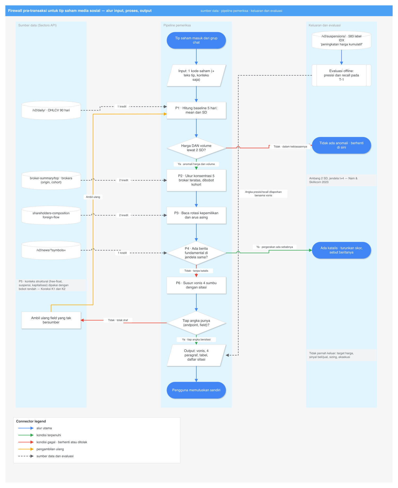

# Deep Research — Firewall Pra-Transaksi untuk Tip Saham Media Sosial

Tanggal: 2026-09-09. Semua pengambilan dilakukan 2026-09-09 kecuali dinyatakan lain.

Topik: **investor ritel menerima satu kode saham dari grup chat dan tidak punya cara membedakan
pergerakan nyata dari yang direkayasa.** Riset terpisah, berdiri sendiri.

Pendamping:
[`ringkas.md`](ringkas.md)
(versi bahasa sederhana). Dokumen ini mendalami ide **#4** di
[`idea-shortlist-2026-09-08.md`](../idea-shortlist-2026-09-08.md), dan bersinggungan dengan
[`agen-risiko-belajar-mandiri.md`](agen-risiko-belajar-mandiri.md) pada bagian
kebocoran label.

Riset kedua yang dijalankan pada sesi yang sama, dengan topik **berbeda** (akses non-visual ke
riset saham), ada di [`tunanetra/deep-research.md`](../tunanetra/deep-research.md).
Kedua dokumen tidak saling bergantung.

**Aturan verifikasi.** Setiap klaim faktual membawa DOI, arXiv ID, nomor siaran pers, atau URL
dengan tanggal pengambilan. Klaim yang tidak terverifikasi diberi awalan `UNVERIFIED:` beserta
catatan apa yang sudah dicoba.

**Batas cakupan.** Tidak memuat strategi trading, sizing posisi, aturan entry/exit, maupun klaim
bahwa metode apa pun memprediksi harga saham secara menguntungkan. Aturan hackathon melarang
eksekusi transaksi otomatis di semua track, dan POJK 5/POJK.04/2019 membatasi siapa yang boleh
memberi rekomendasi beli/jual.

**Biaya kredit Sectors: nol.** Klaim tentang API dibaca dari `research/harness/recorded/`
(tangkapan 6 Sep 2026), bukan dari panggilan baru.

## Sumber primer yang ditarik penuh untuk dokumen ini

| Sumber | Cara ambil | Tanggal | Status |
| --- | --- | --- | --- |
| OJK Siaran Pers **SP 38/GKPB/OJK/II/2026** | `curl` + User-Agent browser ke `ojk.go.id`, HTTP 200, 396 KB | 2026-09-09 | teks penuh, dikutip verbatim |
| `research/harness/recorded/*.json` | baca lokal | rekaman 2026-09-06 | field diverifikasi langsung |
| IOSCO `IOSCOPD795.pdf` (FR/08/2025) | Exa | 2026-09-09 | ekstrak, dikutip verbatim |
| bandarmology.net | Exa | 2026-09-09 | ekstrak halaman fitur |

**Alat yang gagal, dan konsekuensinya.** Firecrawl menolak di tier tanpa kunci — *"your IP address
looks suspicious, so Firecrawl can't be used without an API key"* — dan tidak ada
`FIRECRAWL_API_KEY` di environment maupun konfigurasi. OpenCLI untuk Reddit dan X mengembalikan
`BROWSER_CONNECT — Browser Bridge extension not connected`. Akibatnya **tidak ada data forum yang
diambil secara sistematis**: X dan grup Telegram hanya terlihat lewat hasil pencarian, bukan
lewat crawl. Catatan operasional: `~/.agent-reach/gh-burner.sh search repos` mengembalikan hasil
kosong secara senyap bila diberi `--sort stars`.

---

# Koreksi terhadap dokumen sebelumnya

Tiga klaim di [`idea-shortlist-2026-09-08.md`](../idea-shortlist-2026-09-08.md) perlu direvisi.

**K1. "Float tipis" tidak boleh jadi sumbu utama.** Daftar pendek menempatkan `free_float` sebagai
baris pertama tabel kerapuhan. BEI mengumumkan pada Juli 2026 rencana **menghapus free float
rendah, likuiditas perdagangan rendah, dan suspensi lebih dari satu hari bursa** sebagai kriteria
masuk Papan Pemantauan Khusus, dengan alasan ketiganya mencerminkan karakteristik teknis
perdagangan, bukan kondisi fundamental (Kompas, 2026-07-05). Regulator sendiri sedang menurunkan
bobot float. Skor akhir tidak boleh runtuh bila float dihapus; siapkan uji ablasi.

**K2. "Saham kecil lebih mudah dimanipulasi" tidak terkonfirmasi di IDX.** Daftar pendek menulis
"Kecil dan tidak likuid → mudah digerakkan". Studi atas BEI sendiri menemukan arah sebaliknya —
lihat §B4. Kapitalisasi tetap fitur, tetapi **bukan gerbang**, dan hasil harus dilaporkan per
bucket kapitalisasi.

**K3. `/v2/suspensions/` bukan "riwayat masalah" — ia sumber label.** Daftar pendek menempatkannya
sebagai satu baris konteks seharga 1 kredit. Isinya, dibaca langsung, adalah himpunan event pump
yang dilabeli IDX sendiri, 583 baris, dengan tanggal dan PDF pengumuman. Lihat §B7. Ini yang
mengubah idenya dari heuristik menjadi sesuatu yang bisa dievaluasi presisi–recall-nya.

---

# Pernyataan masalah, dan bukti yang menopangnya

**Masalah.** Ritel menerima satu kode saham dari grup Telegram, unggahan X, atau video YouTube.
Tidak ada alat yang memisahkan pergerakan nyata dari yang direkayasa **sebelum** ia bertindak, dan
penegakan hukum datang tiga sampai empat tahun kemudian.

| # | Klaim masalah | Bukti | Sumber | Bagian |
| --- | --- | --- | --- | --- |
| M1 | Pom-pom saham nyata, bernama, dan dihukum | denda **Rp5,35 miliar**; AYLS, FILM, BSML; periode 2021–2022 | OJK SP 38/GKPB/OJK/II/2026 (primer, ditarik penuh) | §B1 |
| M2 | Penegakan datang terlambat | pelanggaran 2021–2022 → sanksi **20 Feb 2026** | idem | §B1 |
| M3 | Modusnya persis "tip lalu jual ke followers" | *"memanfaatkan reaksi followers atas informasi yang disampaikan"* | idem, verbatim | §B1 |
| M4 | Mengikuti influencer merugikan, terukur | **56% antiskill**, −2,3%/bulan abnormal return; 28% skilled +2,6% | Finfluencers, 29.000 akun StockTwits | §B2 |
| M5 | Sinyal sosial menyesatkan secara sistematis | probabilitas skilled **memprediksi popularitas negatif**, β = −0,80, p<1%; skill bukan penentu survival | idem | §B2 |
| M6 | Celah regulasi diakui lintas yurisdiksi | *"unregistered individuals who influence retail investors without the professional qualifications or oversight required"* | IOSCO FR/08/2025 | §B2 |
| M7 | Paparannya masif dan muda | 30.274.265 SID; ritel **51,1%** nilai transaksi Juli 2026; **54,12%** investor saham < 30 tahun | BEI/KSEI via RMOL 2026-08-10 | §B5 |
| M8 | Kanalnya teridentifikasi | Telegram, Stockbit, Facebook; aktivitas B=0,284, sentimen B=0,329 → volume (p=0,001) | Dananjaya dkk. 2025, DOI `10.24843/eja.2025.v35.i07.p19` | §B4 |
| M9 | Bursa sendiri mencatat eventnya, dan datanya terbuka | **583** suspensi; 18/20 terbaru = *cooling down* atas lonjakan harga kumulatif | `/v2/suspensions/` | §B7 |
| M10 | Alat yang ada justru mengajak ikut, bukan memperingatkan | *"Signal Screener… TP 1 (5%), TP 2 (10%), hingga TP 3 (20%)"*; tagline "Semua Pasti Cuan!" | bandarmology.net | §B9 |

---

# Temuan

## B1. Masalahnya divalidasi regulator tujuh bulan lalu, dengan nama dan tanggal

**OJK, Siaran Pers SP 38/GKPB/OJK/II/2026**, "OJK Beri Sanksi Pegiat Media Sosial dan Pelaku
Manipulasi Harga di Pasar Modal", Jakarta, 20 Februari 2026. Ditarik penuh dari `ojk.go.id`
2026-09-09. Verbatim:

> "OJK menetapkan sanksi berupa denda sebesar Rp5,35 miliar kepada pegiat media sosial Sdr. BVN
> atas pelanggaran manipulasi harga dengan modus penyebaran informasi di media sosial pada
> sejumlah perdagangan saham periode 2021 – 2022."

Emiten dan periodenya, verbatim: **PT Agro Yasa Lestari Tbk (AYLS)** periode 1–27 September 2021
dan 8 November–29 Desember 2021; **PT MD Pictures Tbk (FILM)** periode 12 Januari–27 Desember
2021; **PT Bintang Samudera Mandiri Lines Tbk (BSML)** periode 8 Maret–17 Juni 2022.

Modus pertama — manipulasi transaksi:

> "manipulasi pasar dengan melakukan order beli dan order jual beberapa saham menggunakan
> beberapa rekening Efek sehingga menyebabkan adanya pembentukan harga saham yang tidak
> didasarkan pada kekuatan beli dan jual yang sebenarnya."

Modus kedua — dan ini spesifikasi produk kita, hampir kata per kata:

> "Sdr. BVN memberikan informasi melalui media sosial terhadap satu atau lebih saham, atau
> menyampaikan informasi rencana pembelian saham, atau menyampaikan perkiraan pergerakan harga
> saham tertentu, namun demikian, di saat yang bersamaan, Sdr. BVN melakukan penjualan atau
> pembelian saham dengan memanfaatkan reaksi followers atas informasi yang disampaikan tersebut."

Dasar hukum, verbatim: *"Pasal 90 UUPM sebagaimana diubah dengan Pasal 22 angka 33 UUPPSK,
Pasal 91 UUPM sebagaimana diubah dengan Pasal 22 angka 34 UUPPSK dan Pasal 92 UUPM sebagaimana
diubah dengan Pasal 22 angka 35 UUPPSK."*

Pada siaran yang sama, tiga pihak didenda pada kasus **PT Impack Pratama Industri Tbk (IMPC)**
periode Januari–April 2016: PT Dana Mitra Kencana Rp2,1 miliar (mengalirkan dana ke 17 nasabah,
nilai pertemuan transaksi Rp43.729.255.000), serta Sdr. UPT dan Sdr. MLN masing-masing Rp1,8
miliar (12 nasabah, Rp49.122.252.500).

Dua fakta yang dibawa dokumen ini. Pertama, **kasusnya nyata, bernama, bertanggal, dan primer** —
bahan video yang tidak perlu direkayasa. Kedua, **pelanggaran 2021–2022 baru diputus Februari
2026**: penegakan datang tiga sampai empat tahun setelah ritel rugi. Itulah ruang hidup produk
pencegahan.

## B2. Bukti bahwa "ikut influencer" merugikan, dengan besaran

**Kakhbod, Kazempour, Livdan & Schürhoff**, "Finfluencers". Data tingkat-tweet dari StockTwits,
**lebih dari 29.000 finfluencer**. Verbatim dari abstrak:

> "28% of finfluencers are skilled, generating 2.6% monthly abnormal returns, 16% are unskilled,
> and 56% have negative skill ('antiskill') generating −2.3% monthly abnormal returns.
> Antiskilled finfluencers have more followers and more influence on retail trading than skilled
> finfluencers. … Consequently, finfluencers cause excessive trading and inefficient prices such
> that a contrarian strategy yields 1.2% monthly out-of-sample performance."

Dan mekanisme sosialnya, verbatim dari badan makalah:

> "more skilled finfluencers have fewer followers while less skilled influencers have more
> followers, with antiskilled finfluencers being the most popular"

> "the probability that a user is skilled strongly negatively predicts popularity, with a
> coefficient β = −0.80 significant at 1%"

> "skill is not a significant determinant of survival"

Versi CEPR (Discussion Paper 20204) meringkasnya: *"Consistent with a model where social media
prioritizes engagement over skill, this leads to the spread of false advice and distorted belief
aggregation."*

**UNVERIFIED:** venue terbit final dan tahun definitif makalah ini belum dikonfirmasi — yang
tertarik adalah PDF working paper di `jhfinance.web.unc.edu` dan catatan CEPR DP20204. Kutip
sebagai working paper sampai venue-nya diverifikasi.

Kenapa ini penting untuk produk kita: **popularitas berkorelasi negatif dengan keterampilan.**
Sinyal sosial yang paling mudah dilihat pengguna — jumlah follower, keramaian grup — justru
sinyal yang salah arah. Produk yang mengukur pasar, bukan popularitas, punya alasan keberadaan
yang terukur.

**IOSCO, "Finfluencers — Final Report", FR/08/2025** (`IOSCOPD795.pdf`). Verbatim:

> "many finfluencers are not familiar with traditional financial regulatory frameworks and may
> operate outside them … posing challenges for enforcement and oversight. The Final Report
> identifies potential gaps in regulatory coverage, particularly for unregistered individuals who
> influence retail investors without the professional qualifications or oversight required of
> registered investment advice professionals."

Risiko yang disebut IOSCO — *"spreading misleading or biased information, promotion of higher-risk
or complex products, and inadequate disclosure of any conflicts of interest"* — adalah tiga
kategori yang bisa dipetakan langsung menjadi tiga sumbu output produk.

## B3. Literatur deteksi — skema pelabelan yang bisa langsung ditulis

**Nam & Skillicorn (2023)**, "Detecting Pump&Dump Stock Market Manipulation from Online Forums",
arXiv `2301.11403`. Verbatim dari abstrak:

> "our best model achieves a prediction accuracy of 85% and an F1-score of 62%. Such a tool can
> provide early warning to investors and regulators that a pump&dump may be underway."

Yang benar-benar kita pakai bukan modelnya, melainkan **skema pelabelannya**, verbatim:

> "A rise was detected by calculating the average price and volume in the five-day window before
> the post. … A threshold was set at two standard deviations above the average price within the
> five-day estimation window. Price increases above this threshold were considered to be pump
> events. A similar threshold was used to define a volume anomaly. Events were considered to be
> the result of P&D if they exceeded the threshold for both price and volume."

Dan jendela waktunya, verbatim:

> "[27] studied the effects of online message boards on market manipulation and found that dumps
> typically occur within four days"

Makalah yang sama meringkas **Victor & Hagemann**: 149 skema P&D terkoordinasi lewat Telegram dan
dipompa via Twitter, XGBoost, *"a sensitivity of 85% and specificity of 99%"*, terkonsentrasi pada
kripto berkapitalisasi ≤ USD 50 juta. **UNVERIFIED:** dibaca dari daftar pustaka Nam & Skillicorn,
bukan dari makalah aslinya.

**Bukola et al. (Columbia DSI / Fidelity)**, "Detecting Market Manipulation in Small-Cap
Equities". Dari ~5.000 gugatan perdata SEC 1996–2020, ~500 terkait manipulasi pasar, 50 berujung
vonis P&D, **8 dipakai sebagai kasus uji**. Verbatim dari slide temuan:

> "1. Simple statistical and machine learning models can detect anomalies based on price and
> volume data
> 2. Anomalies must be narrowed down to likely cases by eliminating price/volume movements
> explainable by factor returns, economic news, or legitimate (non-manipulative) company related
> news"

Butir kedua adalah **tahap wajib** yang mudah dilupakan: anomali tanpa penyaringan kausal
menghasilkan alarm palsu pada setiap rilis laba.

Ringkasnya, spesifikasi yang bisa langsung diimplementasikan dan sepenuhnya berasal dari
literatur, bukan dari tebakan:

```
baseline   : jendela 5 hari sebelum tanggal-uji
pump       : harga  > mean(baseline) + 2·SD(baseline)
         DAN volume > mean(baseline) + 2·SD(baseline)
jendela dump: sampai t+4
penyaringan : buang event yang punya berita perusahaan/ekonomi yang sah
              pada jendela yang sama  → /v2/news/?symbols=
```

## B4. Bukti khusus IDX — dan dua kontra-bukti yang membatalkan asumsi

**"Pump-Dump Manipulation Analysis: The Influence of Market Capitalization and Its Impact on
Stock Price Volatility at Indonesia Stock Exchange"**, ProQuest `2088916427`. Sampel 149
perusahaan tercatat di BEI, 30 November – 30 Desember 2015. Verbatim dari abstrak:

> "This study found the existence of pump-dump manipulation in 14 different periods. The result
> of correlation test between trading volume and Cumulative Abnormal Return (CAR) proved positive
> during the next four trading days (t4). The results of this study also obtained evidence that
> small capitalized stocks have lower probability rates for pump-dump manipulation. This goes
> against our proposed hypothesis. While the impact of pump-dump manipulation on stock price
> volatility does not show significant difference test results."

Dua hal sekaligus. Jendela **t+4** dikonfirmasi ulang, kini pada data IDX. Tetapi hipotesis
"small cap lebih rentan" **ditolak pada data IDX** — arahnya justru terbalik. Itu Koreksi K2.
**UNVERIFIED:** penulis dan tahun terbit tidak berhasil ditarik; hanya record ProQuest yang
terbaca. Sampelnya juga satu bulan pada 2015 dan mungkin tidak berlaku pada struktur pasar 2026
(FCA belum ada saat itu). Perlakukan sebagai peringatan terhadap asumsi, bukan sebagai temuan
yang bisa dikutip sebagai fakta pasar hari ini.

**Januardi, Nana Varian (2026)**, "Does Retail Attention Move Prices or Just Trading? Google
Search Evidence from the Indonesia Stock Exchange", DOI `10.15294/jcs.v9i1.53895`. Google search
volume mingguan untuk 65 saham IDX80 yang paling banyak dicari, 2021–2025, panel dengan firm dan
week fixed effects. Verbatim:

> "Attention is associated with next-week abnormal trading volume … Attention does not forecast
> directional returns, and the confidence interval is tight enough to exclude a
> developed-market-sized price continuation. We find no robust reversal and no concentration in
> small stocks; if anything it is stronger among large, recognizable names."

Ini kontra-bukti kedua terhadap "small cap saja", dan sekaligus batas yang harus dihormati produk:
**atensi memprediksi volume, bukan arah harga.** Produk yang menjanjikan arah harga akan salah;
produk yang menjelaskan kerapuhan tidak.

**Dananjaya, Prayudi & Wiguna (2025)**, "The Influence of Retail Investor Activity and Sentiment
on Social Media on Stock Market Dynamics in Bali", *E-Jurnal Akuntansi* 35(7), DOI
`10.24843/eja.2025.v35.i07.p19`. Survei 200 responden aktif di komunitas saham daring, regresi
linear berganda. Kanalnya disebut eksplisit — verbatim: *"active participation in stock
discussions on Telegram groups, Stockbit forums, and Facebook communities"*. Hasil: aktivitas
media sosial B=0,284 (p=0,001) dan sentimen B=0,329 (p=0,001) terhadap volume transaksi
(adj. R²=0,601); terhadap volatilitas harga B=0,301 (p=0,003) dan B=0,366 (p=0,001)
(adj. R²=0,618).

**Catatan metodologis yang harus disebut kalau makalah ini dikutip:** variabel terikatnya adalah
**persepsi responden** atas volume dan volatilitas, diukur dengan skala Likert, bukan data pasar.
Ia bukti tentang perilaku dan keyakinan investor, bukan tentang harga.

## B5. Skala paparannya

| Fakta | Angka | Sumber |
| --- | --- | --- |
| Total investor pasar modal | **30.274.265 SID**, +9.926.440 SID YtD (+48,78%) | BEI per 7 Agustus 2026, via RMOL 2026-08-10 |
| Investor saham | **10.052.059 SID**, +1.447.882 (+16,83%) dari akhir 2025 | idem |
| Porsi nilai transaksi ritel, Juli 2026 | **51,1%** vs institusi asing 35,8%, institusi domestik 13,1% | idem |
| Investor saham usia < 30 tahun | **54,12%** | KSEI, Juni 2026, via RMOL |
| Rata-rata nilai transaksi harian Juli 2026 | Rp22,5 triliun (2025: Rp18,1 triliun) | idem |
| Deret total investor | 3,681 jt (2020) → 7,489 (2021) → 10,311 (2022) → 12,168 (2023) → 14,871 (2024) → 30,3 jt (2026) | idem |
| Nilai aset | Rp8.261 triliun, turun 22% | Bisnis.com 2026-08-10 |

**UNVERIFIED:** angka-angka ini berasal dari pemberitaan atas rilis BEI/KSEI, bukan dari PDF
statistik KSEI. `Statistik_Publik_Juni_2026.pdf` gagal terekstrak rapi lewat Exa; tarik langsung
sebelum dipakai di layar.

Bentuk komersial tipnya terlihat di Telegram publik tanpa perlu login: satu kanal bernama
"Komunitas Rekom Saham Ritel (TIDAK MENJUAL BARANG APAPUN)" memuat rekap akurasi di Google
Sheets, target rebound yang *"saya share khusus di chanel premium RSR dulu yaa"*, pembayaran yang
*"bisa dicicil selama 1 bulan"*, garansi uang kembali 3 hari, dan *"kuota promo tersedia hanya
tersisa untuk 2 orang terakhir"*. POJK 5/POJK.04/2019 mewajibkan izin Penasihat Investasi bagi
pihak yang memberi nasihat investasi secara komersial atau teratur.

## B6. Baseline regulator dan perubahannya

Papan Pemantauan Khusus dengan mekanisme **Full Call Auction** berjalan sejak **Maret 2024**.
Karakteristiknya (EmitenNews, 2025-07-28): notasi **X**, antrean bid-offer tidak ditampilkan
terbuka, jam perdagangan terbatas dalam beberapa sesi, dan auto-rejection lebih ketat — **ARA
+15%, ARB −10%**. Dua IPO 2026, **CDIA** dan **COIN**, langsung masuk FCA setelah terkena UMA dan
tertahan tujuh hari bursa.

Revisi yang diumumkan Juli 2026 (Kompas, 2026-07-05; Kontan, 2026-07-08): **penghapusan tiga
kriteria** — free float rendah, likuiditas perdagangan rendah, suspensi lebih dari satu hari
bursa — plus penyesuaian batas auto rejection dan penerapan **Non-Cancellation Period**. Alasan
yang dikutip: ketiga kriteria itu mencerminkan karakteristik teknis perdagangan, bukan kondisi
fundamental emiten.

Ini Koreksi K1. Desain skor harus tahan terhadap penghapusan float.

## B7. Sumber label yang sudah dibayar dan tersimpan di repo

Dibaca dari `research/harness/recorded/v2_suspensions.json` (rekaman 2026-09-06):

```
pagination: {"total_count": 583, "showing": 20, "limit": 20, "has_next": true}
18 dari 20 baris halaman pertama:
  "Terjadinya peningkatan harga kumulatif yang signifikan pada saham <X>.JK,
   dalam rangka cooling down sebagai bentuk perlindungan bagi investor"
2 dari 20:
  "Sehubungan dengan adanya ketidakpastian atas kelangsungan usaha…"
rentang tanggal halaman pertama: 2026-08-11 … 2026-09-04
field per baris: symbol, suspension_date, reason, pdf_url
pdf_url menunjuk ke pengumuman asli di idx.co.id
```

`/v2/suspensions/` adalah **himpunan event pump yang dilabeli IDX sendiri**: alasan tekstual yang
bisa diklasifikasi, tanggal presisi, dan PDF resmi sebagai provenance. 583 baris ÷ 20 per halaman
≈ **30 panggilan ≈ 30 kredit** untuk seluruh sejarah yang tersedia.

**Protokol evaluasi yang dimungkinkannya:**

1. Tarik seluruh 583 suspensi. Saring `reason` yang memuat "peningkatan harga kumulatif yang
   signifikan" sebagai **positif**; sisanya (kelangsungan usaha, dll.) sebagai kelas terpisah,
   bukan negatif.
2. Untuk tiap positif, tarik `/v2/daily/{symbol}/` dan hitung profil kerapuhan **pada T−1** —
   sebelum pengumuman suspensi. Ini yang mengukur apakah produk memperingatkan lebih dulu.
3. Bangun kontrol negatif dari emiten dengan lonjakan volume ≥2 SD yang **tidak** berujung
   suspensi dalam 10 hari bursa.
4. Laporkan presisi dan recall pada T−1, dipecah per bucket kapitalisasi (karena K2).

**Kebocoran label yang harus dihindari.** `/v2/free-float/` (961 baris) dan `/v2/companies/`
mengembalikan **snapshot hari ini**, tanpa tanggal. Memakai float hari ini untuk menilai event
Agustus adalah kebocoran. Gunakan `/v2/company/shareholders-composition/{symbol}/`, yang bertanggal
bulanan — koreksi yang sama sudah dipakai di
[`agen-risiko-belajar-mandiri.md`](agen-risiko-belajar-mandiri.md).

**UNVERIFIED:** hanya 20 dari 583 baris yang terbaca. Kosakata `reason` pada 563 baris sisanya
belum diketahui, dan skema pelabelan bergantung padanya. Ini probe pertama yang harus dijalankan,
dan biayanya ~30 kredit.

## B8. Peta endpoint — field diverifikasi dari payload nyata, bukan dari spesifikasi

| Sumbu | Endpoint | Field yang benar-benar kembali |
| --- | --- | --- |
| Label event | `/v2/suspensions/` | `symbol`, `suspension_date`, `reason`, `pdf_url`; `pagination.total_count = 583` |
| Anomali harga & volume | `/v2/daily/{symbol}/` | `symbol, date, open, high, low, close, volume, market_cap` |
| Papan panas harian | `/v2/most-traded/` | dict berkunci tanggal (20 tanggal per respons) → `symbol, company_name, volume, price` (5 nama per tanggal) |
| Konsentrasi broker | `/v2/broker-summary/{symbol}/top/` | `symbol, start, end, origin, cohort, top_buyers[], top_sellers[]`; tiap entri `rank, broker_code, net_idr, buy_idr, sell_idr`. **Koreksi C2:** `origin` dan `cohort` di tingkat atas adalah *gema permintaan* (`"all"`, `"all"`), bukan data — entri broker tidak membawa kohort sendiri. Kohort harus di-*join* ke `/v2/brokers/`, atau diminta lewat parameter kueri `cohort=`/`origin=` (keduanya didukung) |
| Identitas broker | `/v2/brokers/` | **Koreksi C1:** payload nyata mengembalikan `code, name, is_foreign, cohort, license_type` — **tidak ada field `origin`**. Keasingan adalah boolean `is_foreign`. (Field `origin` hanya ada di `synth/flow/brokers.json`, sehingga parser yang ditulis terhadap data sintetis akan `KeyError` pada payload nyata.) Cache selamanya |
| Arus asing | `/v2/foreign-flow/{symbol}/` | `symbol, start, end, data[]` berisi `date, net_foreign_inflow` |
| Ketipisan | `/v2/free-float/` | 961 baris `symbol, company_name, free_float` (desimal) — **snapshot, tanpa tanggal** |
| Rotasi kepemilikan | `/v2/company/shareholders-composition/{symbol}/` | per tanggal bulanan: `shares_number` + 9 kategori lokal (`insurance_l, corporate_l, pension_fund_l, financial_institutions_l, individual_l, mutual_fund_l, securities_companies_l, foundation_l, other_l, total_l`) dan 9 kategori asing (`*_f`) |
| Papan gainer | `/v2/companies/top-changes/` | `top_gainers.1d[]` → `name, symbol, price_change, last_close_price, latest_close_date` |
| Katalis | `/v2/news/?symbols=` | `results[].title, body, source` + `pagination` |

Contoh nyata dari rekaman, berguna sebagai frame pembuka video: pada `top-changes` tanggal
2026-09-04, tiga nama teratas adalah **UANG.JK +24,92%**, **RONY.JK +24,90%**, **SMMT.JK +24,88%**
— **Koreksi C4:** angka itu hanya muncul dengan `?min_mcap_billion=0`. Panggilan default
mengembalikan SMMT +24,88%, NATO +24,63%, PKPK +17,43%. Frame video wajib memasang
`?classifications=top_gainers&min_mcap_billion=0&periods=1d`; membiarkan `classifications`
default juga menaikkan biaya dari 1 menjadi 10 kredit —
— semuanya menempel di pagar ARA papan utama. Dan pada `most-traded` 2026-08-06, nama tervolume
adalah **BNBR.JK** pada harga **Rp105** dengan volume 7.994.414.100 lembar. Saham yang menempel di
ARA berhari-hari tanpa satu pun entri di `/v2/news/` adalah kasus definisional yang menjelaskan
dirinya sendiri.

## B9. Kompetitor terdekat, dengan polaritas terbalik

**bandarmology.net** (diambil via Exa 2026-09-09) menjual, verbatim dari situsnya: deteksi
akumulasi bandar real-time — *"Temukan saham-saham yang sedang diakumulasi besar-besaran (Big ACC)
oleh Big Player"*; analisa teknikal dengan data bandarmologi; bedah emiten satu halaman dengan
*"rata-rata harga bandar (AVG), hingga top buyer dan top seller"*; *"rekomendasi alokasi dana"*;
dan **sinyal otomatis** — *"Signal Screener memberikan rekomendasi TP 1 (5%), TP 2 (10%), hingga
TP 3 (20%) secara otomatis berdasarkan volatilitas harga"*. Tagline: *"Semua Pasti Cuan!"*.

Data yang sama, arah yang berlawanan. Mereka memakai konsentrasi broker sebagai **ajakan ikut**;
kita memakainya sebagai **peringatan menjauh**. Selisih itu juga garis kepatuhan: "TP 20%
otomatis" adalah rekomendasi investasi dalam pengertian POJK 5/2019; "saham ini rapuh karena empat
alasan, ini angkanya, ini sumbernya" adalah deskripsi risiko.

## B10. Deliverable — sumbu kerapuhan, diurutkan menurut kekuatan bukti

| Sumbu | Endpoint | Dukungan bukti | Bobot |
| --- | --- | --- | --- |
| Anomali harga **dan** volume ≥ 2 SD atas baseline 5 hari | `/v2/daily/` | Nam & Skillicorn 2023 (skema eksplisit); Columbia/Fidelity | **tinggi** |
| Ketiadaan katalis pada jendela yang sama | `/v2/news/` | Columbia/Fidelity, tahap 2 wajib | **tinggi** |
| Konsentrasi broker, dibobot kohort | `/v2/broker-summary/top/` + `/v2/brokers/` | OJK SP 38: "beberapa rekening Efek"; bandarmology memakai sinyal yang sama dari sisi lain | **tinggi** |
| Ritel masuk sementara institusi keluar | `shareholders-composition` (bulanan) | Finfluencers: antiskilled menggerakkan retail order imbalance | sedang |
| Menempel ARA berhari-hari | `/v2/daily/` + aturan ARA ±15%/−10% | struktur pasar BEI | sedang |
| Kapitalisasi kecil | `/v2/companies/` | **kontradiktif di IDX** (ProQuest); tidak terkonsentrasi (Januardi 2026) | rendah, dilaporkan per bucket |
| Free float tipis | `/v2/free-float/` | BEI menghapusnya sebagai kriteria FCA; snapshot, rawan kebocoran | rendah, dengan uji ablasi |

**Metrik yang dilaporkan**: presisi dan recall pada T−1 terhadap 583 suspensi, dipecah per bucket
kapitalisasi, dengan dan tanpa sumbu float. Bukan akurasi (kelasnya sangat tidak seimbang), dan
bukan klaim kualitatif.

---

## B11. Kontrak input – proses – output



Sumber diagram: [`diagrams/alur.py`](diagrams/alur.py) →
[`diagrams/alur.drawio`](diagrams/alur.drawio).


Ditulis sebagai kontrak supaya implementasi tidak melenceng, dan supaya tiap langkah bisa dilacak
ke bagian yang membenarkannya.

### Input

| Field | Tipe | Wajib | Catatan |
| --- | --- | --- | --- |
| `symbol` | string, kode IDX | **ya** | satu-satunya masukan wajib |
| `tip_text` | string bebas | tidak | tempelan pesan Telegram/X; dipakai hanya untuk menampilkan konteks, **tidak** untuk klasifikasi bahasa (tidak ada model bahasa terlatih untuk itu di sini) |
| `verbosity` | `ringkas` \| `lengkap` | tidak | default `ringkas` |
| `audio` | bool | tidak | default mati; lapisan opsional, spesifikasinya ada di riset aksesibilitas (§A4 dokumen itu), bukan di sini |

Tidak ada pilihan indikator, periode, atau ambang. Ambangnya berasal dari literatur (§B3), bukan
dari pengguna.

### Proses

```
P0  Planner sadar-anggaran
    tentukan endpoint yang perlu ditarik untuk symbol ini
    target ~10 kredit/emiten; cek cache lokal lebih dulu

P1  Baseline dan anomali                                  [Nam & Skillicorn 2023]
    GET /v2/daily/{symbol}/                → OHLCV, rentang ≤90 hari
                                             KOREKSI C5: tidak ada parameter `limit` di spec;
                                             batas ada pada rentang, jadi kirim `start`/`end` eksplisit
    baseline = mean, SD atas 5 hari sebelum tanggal-uji
    pump_flag = (close > mean_p + 2·SD_p) AND (volume > mean_v + 2·SD_v)
    jendela pengamatan lanjutan: t+4

P2  Konsentrasi penggerak
    GET /v2/broker-summary/{symbol}/top/   → rank, broker_code, net_idr, buy_idr, sell_idr
    GET /v2/brokers/                       → code, name, is_foreign, cohort, license_type
                                             KOREKSI C1: tidak ada `origin`; pakai `is_foreign`
                                             (cache selamanya)
    metrik = pangsa nilai beli 5 broker teratas, dibobot kohort

P3  Rotasi kepemilikan
    GET /v2/foreign-flow/{symbol}/         → net_foreign_inflow harian
    GET /v2/company/shareholders-composition/{symbol}/
                                           → 9 kategori _l + 9 kategori _f, bertanggal bulanan
    pola dicari: individual_l naik sementara kategori institusi/asing turun

P4  Penyaring kausal                                      [Columbia/Fidelity, tahap 2]
    GET /v2/news/?symbols={symbol}
    bila ada berita fundamental pada jendela yang sama → turunkan skor anomali
    bila nol hasil                                        → pertahankan

P5  Konteks struktural (bobot rendah, lihat Koreksi)
    GET /v2/suspensions/?symbol=          → riwayat cooling down
    GET /v2/free-float/                   → float; bobot RENDAH  (K1)
    GET /v2/companies/                    → market_cap; FITUR, bukan gerbang  (K2)

P6  Verifikator fail-closed
    setiap angka dalam draf keluaran harus membawa (endpoint, field)
    angka tanpa pasangan itu  → tolak draf, paksa pengambilan ulang
    bila data tidak tersedia  → katakan "belum diambil", jangan mengarang
```

### Output

Satu objek, dua permukaan render.

| Bagian | Isi | Dibenarkan oleh |
| --- | --- | --- |
| Vonis | satu kalimat, mis. "Rapuh pada 3 dari 4 sumbu" | Lundgard tingkat 3 (pola), bukan tingkat 1 |
| Empat paragraf sumbu | tiap paragraf: angka → pembanding → sitasi | Lundgard tingkat 2–3 |
| Tabel semantik | `<th>`, `scope`, `caption`, angka mentah | Sharif 2021 (Google Charts menang karena tabel) |
| Daftar sitasi | endpoint + field per angka | verifikator fail-closed |
| Sonifikasi (opsional) | tren harga 90 hari, arus asing kumulatif, earcon event | Fu 2026 zona paritas (§A4 dokumen aksesibilitas) |
| **Tidak pernah ada** | target harga, sinyal beli/jual, sizing, eksekusi | POJK 5/2019; aturan hackathon |

### Kontrak evaluasi

Keluaran produk diuji terhadap label IDX, bukan terhadap selera:

```
positif   : suspensi dengan reason "peningkatan harga kumulatif yang signifikan"
negatif   : lonjakan volume ≥2 SD yang TIDAK berujung suspensi dalam 10 hari bursa
titik uji : T−1 (sehari sebelum pengumuman bursa)
metrik    : presisi dan recall, dipecah per bucket kapitalisasi,
            dilaporkan dengan dan tanpa sumbu free_float
```

---


# Sintesis

## S1. Urutan bangun

1. **Tarik 583 suspensi (~30 kredit)** dan periksa kosakata `reason`. Semua yang lain bergantung
   pada apakah label ini benar-benar bisa diklasifikasi.
2. **Pipeline kerapuhan** sesuai §B11, dievaluasi pada T−1 dengan protokol §B7.
3. **Verifikator angka fail-closed**: setiap figur membawa sitasi endpoint + field.
4. **Laporkan presisi dan recall**, dipecah per bucket kapitalisasi, dengan dan tanpa sumbu float.

## S2. Risiko

| Risiko | Bukti | Mitigasi |
| --- | --- | --- |
| Produk terbaca sebagai rekomendasi tanpa izin | POJK 5/2019; IOSCO FR/08/2025 tentang "unregistered individuals" | deskripsi risiko + sitasi saja; tanpa target harga, sinyal beli/jual, sizing, eksekusi |
| Skor bertumpu pada `free_float` | BEI menghapusnya sebagai kriteria FCA, Juli 2026 | bobot rendah + uji ablasi |
| Asumsi "small cap = manipulasi" | ProQuest 2088916427 menemukan arah sebaliknya di IDX; Januardi 2026 tidak menemukan konsentrasi | fitur, bukan gerbang; laporkan per bucket |
| Kebocoran label dari snapshot | `free-float` dan `companies` tanpa tanggal | `shareholders-composition` bulanan; batasan dinyatakan di UI |
| Alarm palsu pada rilis laba | Columbia/Fidelity tahap 2 | penyaring kausal `/v2/news/` wajib |
| Menjanjikan arah harga | Januardi 2026: atensi memprediksi volume, bukan return | keluaran hanya menjelaskan kerapuhan |

## S3. Daftar `UNVERIFIED` — probe berikutnya, terurut

1. **Kosakata `reason` pada 563 suspensi sisanya.** ~30 kredit. Memblokir seluruh protokol
   evaluasi.
2. **Venue dan tahun terbit "Finfluencers"** (Kakhbod, Kazempour, Livdan, Schürhoff). Saat ini
   hanya working paper + CEPR DP20204.
3. **Penulis dan tahun studi pump-dump BEI** (ProQuest 2088916427); hanya record yang terbaca.
4. **Victor & Hagemann** — dibaca dari daftar pustaka Nam & Skillicorn, bukan aslinya.
5. **Statistik KSEI resmi** — `Statistik_Publik_Juni_2026.pdf` gagal diekstrak; angka saat ini
   dari pemberitaan atas rilis BEI.
6. **Suara komunitas**: X dan grup Telegram belum di-crawl. Butuh ekstensi OpenCLI aktif atau
   kunci Firecrawl.
7. ~~**Apakah `cohort` pada `/v2/brokers/` benar-benar membedakan ritel dan institusi dengan
   andal**~~ — **TERJAWAB (Koreksi C3), gratis, dari `recorded/v2_brokers.json`**: n=88 →
   `mixed` 42, `institutional` 39, `retail` **5**, `unknown` 2. Hanya 5 dari 88 broker berlabel
   `retail`, sehingga kalimat keluaran seperti *"empat dari lima broker adalah kohort ritel"*
   praktis tidak dapat diproduksi. **Sumbu ini dispesifikasi ulang sebagai dominasi
   institusional/campuran**, bukan partisipasi ritel — lihat `src/fragility.py:score_broker`.

---

## Sumber

- OJK, Siaran Pers SP 38/GKPB/OJK/II/2026 (2026-02-20)
- Kakhbod, A., Kazempour, S. M., Livdan, D., & Schürhoff, N. *Finfluencers.* Working paper;
  CEPR DP20204
- IOSCO (2025). *Finfluencers — Final Report.* FR/08/2025, `IOSCOPD795.pdf`
- Nam, D., & Skillicorn, D. B. (2023). *Detecting Pump&Dump Stock Market Manipulation from Online
  Forums.* arXiv `2301.11403`
- Bukola, T. et al. *Detecting Market Manipulation in Small-Cap Equities.* Columbia Data Science
  Institute / Fidelity
- *Pump-Dump Manipulation Analysis: The Influence of Market Capitalization and Its Impact on Stock
  Price Volatility at Indonesia Stock Exchange.* ProQuest `2088916427`
- Januardi, N. V. (2026). *Does Retail Attention Move Prices or Just Trading? Google Search
  Evidence from the Indonesia Stock Exchange.* DOI `10.15294/jcs.v9i1.53895`
- Dananjaya, I G. N. A., Prayudi, M. A., & Wiguna, I G. N. H. (2025). *The Influence of Retail
  Investor Activity and Sentiment on Social Media on Stock Market Dynamics in Bali.* E-Jurnal
  Akuntansi 35(7). DOI `10.24843/eja.2025.v35.i07.p19`
- POJK Nomor 5/POJK.04/2019 tentang Penasihat Investasi
- UU No. 8 Tahun 1995 tentang Pasar Modal, Pasal 90–92, sebagaimana diubah UU No. 4 Tahun 2023
  (UU PPSK) Pasal 22 angka 33–35
- EmitenNews (2025-07-28); Kompas (2026-07-05); Kontan (2026-07-08); Strategi.id (2025-08-05);
  Jernih.co (2026-02-21); RMOL (2026-08-10); Bisnis.com (2026-08-10); bandarmology.net
- `research/harness/recorded/` — tangkapan langsung 2026-09-06, 160 slug, 66 endpoint callable
