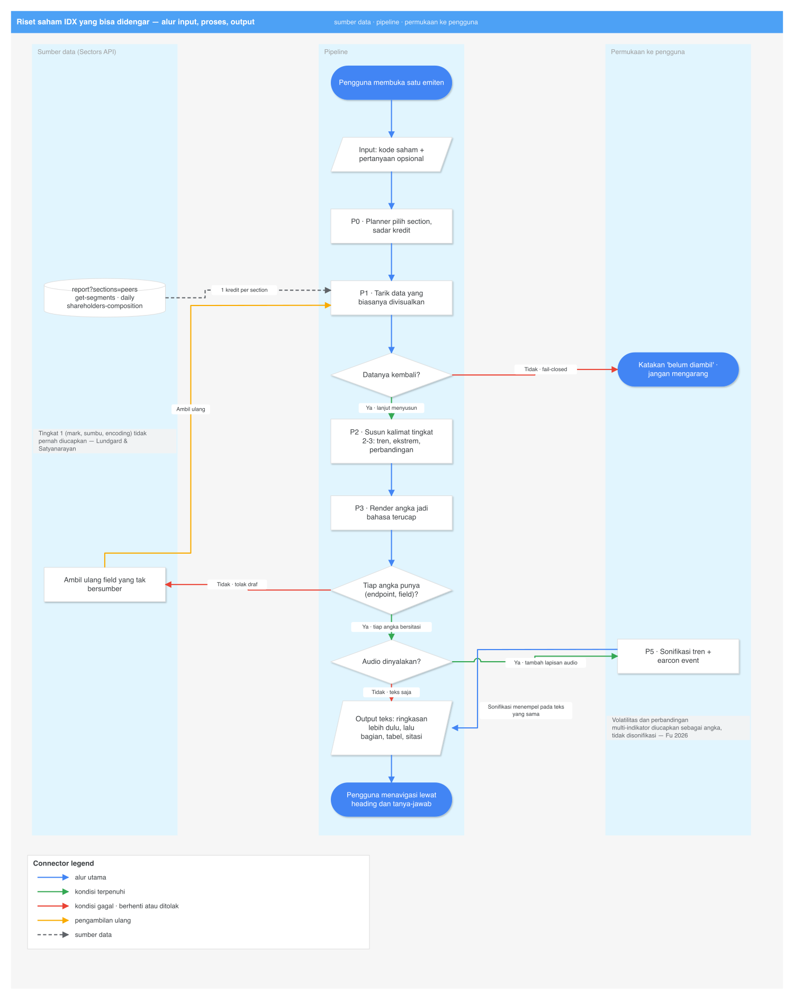

# Deep Research — Akses Non-Visual ke Riset Saham IDX

Tanggal: 2026-09-09. Semua pengambilan dilakukan 2026-09-09 kecuali dinyatakan lain.

Topik: **investor tunanetra dan low-vision yang tidak bisa membaca grafik, laporan keuangan, dan
dokumen emiten.** Riset terpisah, berdiri sendiri.

Pendamping: [`ringkas.md`](ringkas.md)
(versi bahasa sederhana). Dokumen ini mendalami ide **#5** di
[`idea-shortlist-2026-09-08.md`](../idea-shortlist-2026-09-08.md).

Riset kedua yang dijalankan pada sesi yang sama, dengan topik **berbeda**, ada di
[`pump-and-dump/deep-research.md`](../pump-and-dump/deep-research.md). Kedua
dokumen tidak saling bergantung. Satu paragraf tentang irisannya ada di §A11, dan itu bukan
premis dokumen ini.

**Aturan verifikasi.** Setiap klaim faktual membawa DOI, arXiv ID, nomor peraturan, atau URL
dengan tanggal pengambilan. Klaim yang tidak terverifikasi diberi awalan `UNVERIFIED:` beserta
catatan apa yang sudah dicoba.

**Batas cakupan.** Dokumen ini tentang akses dan penyajian informasi. Tidak memuat strategi
trading, sinyal, maupun klaim prediksi harga.

**Biaya kredit Sectors: nol.** Klaim tentang API dibaca dari `research/harness/recorded/`
(tangkapan 6 Sep 2026), bukan dari panggilan baru.

## Sumber primer yang ditarik penuh untuk dokumen ini

| Sumber | Cara ambil | Tanggal | Status |
| --- | --- | --- | --- |
| **POJK 22 Tahun 2023** (PDF, 848 KB) | `curl` + `pdftotext -layout` | 2026-09-09 | teks penuh, nomor pasal diverifikasi |
| `accessibletrader.com` | Jina Reader | 2026-09-09 | teks penuh |
| `github.com/churst90/accessible-trade-terminal` | `gh api repos/...` (akun burner) | 2026-09-09 | metadata repo |
| Highcharts, dokumentasi modul `sonification` dan `accessibility` | Jina Reader | 2026-09-09 | teks penuh |
| `research/harness/recorded/*.json` | baca lokal | rekaman 2026-09-06 | field diverifikasi langsung |

**Alat yang gagal, dan konsekuensinya.** Firecrawl menolak di tier tanpa kunci — *"your IP address
looks suspicious, so Firecrawl can't be used without an API key"* — dan tidak ada
`FIRECRAWL_API_KEY` di environment maupun konfigurasi. OpenCLI untuk Reddit dan X mengembalikan
`BROWSER_CONNECT — Browser Bridge extension not connected`. Akibatnya **tidak ada data forum**:
`r/Blind` tidak terambil. Semua suara pengguna berasal dari media terbit dan literatur akademik.
Catatan operasional: `~/.agent-reach/gh-burner.sh search repos` mengembalikan hasil kosong secara
senyap bila diberi `--sort stars`.

---

# Koreksi terhadap dokumen sebelumnya

**K1. Kategori "terminal trading aksesibel" sudah terisi.** Daftar pendek tidak menyebut prior
art. Ada satu, aktif, GPL-3.0 — lihat §A7. Konsekuensinya bukan membatalkan idenya, melainkan
memindahkan sasarannya dari charting teknikal ke riset fundamental IDX.

**K2. "Tunanetra tidak bisa memakai aplikasi trading" tidak akurat.** Kesaksian terbit menyatakan
bagian transaksi sudah relatif terpecahkan oleh TalkBack/VoiceOver pada sebagian sekuritas. Yang
belum terpecahkan adalah riset emiten — lihat §A5. Ini mengubah sasaran produk.

---

# Pernyataan masalah, dan bukti yang menopangnya

**Masalah.** Investor tunanetra dan low-vision tidak punya jalan mandiri untuk menganalisis
emiten IDX: grafik tidak terbaca, laporan keuangan disajikan sebagai gambar tabel, dan alat yang
"kompatibel screen reader" hanya berarti label bisa dibacakan, bukan informasinya bisa diambil.

| # | Klaim masalah | Bukti | Sumber | Bagian |
| --- | --- | --- | --- | --- |
| M1 | Grafik menutup akses, terukur | **61,48%** kurang akurat (34% vs 87%); **210,96%** lebih lama; 33% grafik tak terdeteksi screen reader | Sharif dkk. 2021, DOI `10.1145/3441852.3471202` | §A1 |
| M2 | Yang menolong adalah tabel, bukan alt text | Google Charts 73% (punya tabel alternatif) vs D3 17% vs Chart.js 11% | idem | §A1 |
| M3 | Lapisan teks+audio menutup hampir seluruh gap akurasi | 34% → **75%**; gap 62% → **15%**; waktu −36% | VoxLens, DOI `10.1145/3491102.3517431` | §A2 |
| M4 | Yang dibutuhkan bukan chart, tapi laporan keuangan | *"Tanpa laporan keuangan perusahaan yang dapat dibaca screen reader, difabel netra akan kesulitan menganalisis kinerja emiten secara mendalam"* | Solider News 2026-02-11 | §A5 |
| M5 | Sebelum screen reader, satu-satunya jalan adalah menyerahkan transaksi ke orang lain | *"setiap kali ingin membeli atau menjual saham, ia harus meminta bantuan broker"* | idem | §A5 |
| M6 | Kewajiban hukumnya sudah berlaku | Pasal 8 ayat (3) huruf b; penjelasan Pasal 54 ayat (3) huruf b dan g | POJK 22/2023 (primer, PDF penuh) | §A6 |
| M7 | Kewajiban itu tak bersanksi tegas, sehingga tak dijalankan | *"belum ada aturan pemberian sanksi yang tegas"* | Adib 2020, DOI `10.24042/al-mal.v1i2.5924` | §A6 |
| M8 | Populasinya besar tapi datanya berantakan | ~1,5% penduduk ≈ **4 juta** (AIDRAN 2023); hanya 1% penyandang disabilitas bekerja di sektor formal | Suara.com 2024-10-04 | §A8 |
| M9 | Institusi sudah mengedukasi tapi tidak menyediakan alat | Sekolah Pasar Modal BEI, kelas Hari Braille, kelas difabel Palembang | jatimmedia 2021; sumsel.suara 2025 | §A8 |

---

# Temuan

## A1. Besar kesenjangannya, terukur

**Sharif, Chintalapati, Wobbrock & Reinecke (2021)**, "Understanding Screen-Reader Users'
Experiences with Online Data Visualizations", *ACM ASSETS 2021*, DOI `10.1145/3441852.3471202`.
Dua studi: kualitatif (9 pengguna screen reader) dan kuantitatif (36 vs 36). Verbatim dari
abstrak:

> "screen-reader users extract information 61.48% less accurately and spend 210.96% more time
> interacting with online data visualizations compared to non-screen-reader users."

Angka pendukung dari badan makalah, yang lebih berguna daripada abstraknya:

> "AEI is considerably lower for screen reader users (34%) compared to non-screen-reader users
> (87%)—a percentage difference of 61.48%."

> "Google Charts had the best performance (73%) for screen-reader users, followed by D3 (17%)
> and ChartJS (11%)."

Dan temuan yang paling menentukan arsitektur produk:

> "33% of the visualizations in our study, from a sample of 27 visualizations, were
> undiscoverable to screen readers."

> "screen-reader users suggested tabular and textual representation of data as techniques to
> improve the accessibility of online visualizations."

Baca Google Charts itu baik-baik: ia menang **bukan** karena grafiknya lebih baik, melainkan
karena ia menyediakan representasi tabular alternatif yang hanya terlihat oleh screen reader.
Selisih 73% vs 11% antara Google Charts dan Chart.js adalah selisih antara *ada tabel* dan
*tidak ada tabel*. Ini bukan argumen bahwa grafik butuh alt text. Ini bukti empiris bahwa jalur
teks/tabel mengungguli jalur grafik-yang-diaksesibelkan sebesar 4–7×.

## A2. Apa yang terbukti menutup kesenjangan itu

**Sharif, Wang, Muongchan, Reinecke & Wobbrock (2022)**, "VoxLens: Making Online Data
Visualizations Accessible with an Interactive JavaScript Plug-In", *ACM CHI 2022*, DOI
`10.1145/3491102.3517431`. Kode: `github.com/athersharif/voxlens`. Tiga mode — Question-and-Answer,
Summary, Sonification — dipasang dengan satu baris JavaScript. Eksperimen berbasis tugas, 21
pengguna screen reader. Verbatim:

> "VoxLens improves the accuracy of information extraction and interaction time by 122% and 36%,
> respectively, over existing conventional interaction with online data visualizations."

> "VoxLens users achieving 75% accuracy (SD = 18.0%) and non-VoxLens users achieving only 34%
> accuracy (SD = 20.1%)."

Dan angka yang paling penting untuk kita, karena ia mengukur *sisa* kesenjangannya:

> "VoxLens improved the accuracy of information extraction of screen-reader users by 122%,
> reducing the information extraction gap between the two user groups from 62% to 15%. However,
> in terms of interaction time, while VoxLens reduced the gap from 211% to 99%, the difference is
> still statistically significant."

Terjemahan operasional: **ringkasan + tanya-jawab + sonifikasi menutup hampir seluruh kesenjangan
akurasi (62% → 15%), tetapi hanya separuh kesenjangan waktu (211% → 99%).** Makalahnya sendiri
menjelaskan sisanya: mendengar sonifikasi memakan waktu ketika kardinalitas data besar. Itu
memberi kita aturan desain yang keras — **jangan sonifikasi deret panjang; ringkas dulu, sonifikasi
belakangan, dan sediakan jalan pintas ke angka.**

## A3. Bentuk kalimat yang harus diucapkan

**Lundgard & Satyanarayan (2021)**, "Accessible Visualization via Natural Language Descriptions:
A Four-Level Model of Semantic Content", *IEEE TVCG* (Proc. VIS), DOI `10.1109/TVCG.2021.3114770`,
arXiv `2110.04406`. Analisis grounded theory atas 2.147 kalimat; evaluasi dengan **30 pembaca
tunanetra dan 90 pembaca awas**. Empat tingkat konten semantik:

1. properti konstruksi visualisasi (mark, encoding, sumbu),
2. konsep dan relasi statistik (ekstrem, korelasi),
3. fenomena perseptual/kognitif (tren kompleks, pola),
4. wawasan spesifik-domain (konteks sosial, politik, bisnis).

Verbatim:

> "these reader groups differ significantly on which semantic content they rank as most useful"

> "research in automatic visualization captioning should orient toward descriptions that more
> richly communicate overall trends and statistics, sensitive to reader preferences"

Konsekuensi langsung: **jangan mengucapkan tingkat 1.** "Grafik batang dengan sumbu-x tanggal"
adalah konten yang paling tidak berguna bagi pembaca tunanetra. Yang diminta adalah tingkat 2 dan
3 — tren, ekstrem, perbandingan — dan itu persis bentuk yang dihasilkan dari JSON Sectors tanpa
pernah merender grafik sama sekali.

## A4. Sonifikasi: di mana ia bekerja, dan di mana ia gagal

**Fu, Jano (2026)**, "Sonification and sensory substitution for accessible technical analysis of
stock charts", DOI `10.82308/55987`. Hibrida parameter-mapping sonification + TTS eksplisit,
merender harga penutupan, RSI, dan Bollinger Bands sebagai stream audio terkoordinasi. Desain
within-subject, N=18 partisipan awas, plus validasi kualitatif dengan 3 partisipan tunanetra/
low-vision. Metrik: chance-normalized accuracy, completion time, NASA-TLX. Verbatim:

> "Although the visual baseline achieves higher overall accuracy than Audio+TTS, the audio
> condition meets key accessibility requirements for a meaningful subset of trading-relevant
> tasks. Completion time is comparable across modalities, and task-level analyses show parity for
> lower-complexity judgments, especially trend assessment and event detection."

> "The main performance gaps emerge in higher-complexity demands: volatility judgments that rely
> on perceiving band width, and tasks that require concurrent integration of multiple indicators."

> "event cues should be high-contrast and symmetric, and effective analysis is better supported by
> staged, multi-pass listening supplemented with concise spoken anchors and calibration references"

Aturan desain yang jatuh dari ini, tanpa penafsiran bebas:

| Tugas | Modalitas | Alasan |
| --- | --- | --- |
| Arah tren (harga 90 hari, arus asing kumulatif) | sonifikasi | zona paritas |
| Deteksi event (menyentuh ARA, lonjakan volume) | earcon kontras-tinggi, simetris | zona paritas |
| Volatilitas | **diucapkan sebagai angka** | zona gagal |
| Perbandingan banyak indikator sekaligus | **diucapkan, satu per satu, bertahap** | zona gagal |

**Tooling.** Highcharts memiliki modul `sonification` terpisah dari modul `accessibility`;
dokumentasinya menyatakan modul aksesibilitasnya memakai **WCAG 2.2** sebagai acuan dan
menambahkan navigasi keyboard, ARIA, deskripsi teks, serta tabel data alternatif (diambil
2026-09-09). Sweep GitHub tanpa akun nyata menemukan pustaka sonifikasi matang hanya di domain
astronomi — `spacetelescope/astronify`, `james-trayford/strauss`, `interactive-sonification/pya` —
tidak ada yang siap-pakai untuk deret harga. VoxLens menyatakan alasan yang sama:

> "Existing sonification tools are either proprietary or written in a programming language other
> than JavaScript, making them unintegratable with popular JavaScript visualization libraries."

Artinya sonifikasi deret harga IDX **harus ditulis sendiri** di atas Web Audio API. Itu kecil, dan
itu justru komponen yang dinilai sebagai kedalaman teknis.

## A5. Penggunanya, dari kesaksian terbit

Tiga liputan independen, semuanya mengarah ke kesimpulan yang sama dan berlawanan dengan asumsi
awam.

- **Solider News, "Netra dan Investasi Saham: Masih Banyak Hambatan"** (2026-02-11) dan
  **Beritalima** (2026-02-23), keduanya memuat kasus I Nyoman Suandi (Denpasar). Sebelum Android
  dan screen reader memadai, satu-satunya jalannya adalah broker: *"setiap kali ingin membeli atau
  menjual saham, ia harus meminta bantuan broker"*, dan analisis hanya lewat radio atau obrolan
  sesama investor. Setelah screen reader membaik ia belajar transaksi mandiri dan **memilih
  sekuritas berdasarkan apakah aplikasinya terbaca screen reader**. Yang tersisa, dikutip Solider:
  *"Tanpa laporan keuangan perusahaan yang dapat dibaca screen reader, difabel netra akan
  kesulitan menganalisis kinerja emiten secara mendalam."*
- **ANTARA News** (2025-11-01) memuat Tutus, guru SLB Surabaya, 45 tahun, masuk lewat Sekolah
  Pasar Modal BEI Jawa Timur 2018 dengan modal Rp5 juta, berbicara di CMSE 2025; dan Toviyani Widi
  Saputri, mahasiswi UIN Sunan Kalijaga, yang bertransaksi mandiri lewat TalkBack.
- Yulianto, investor tunanetra yang dikutip Solider dan Beritalima, menambahkan dua hal:
  aksesibel ≠ inklusif, dan peringatan terhadap **ketergantungan pada rekomendasi instan** —
  yang merupakan topik riset terpisah — lihat [`pump-and-dump/deep-research.md`](../pump-and-dump/deep-research.md).

**Kesimpulan yang mengubah desain:** bagian *order entry* sudah relatif terpecahkan oleh
TalkBack/VoiceOver pada sebagian sekuritas. Yang belum terpecahkan adalah **riset emiten**.
Jangan bangun terminal transaksi; bangun lapisan riset.

## A6. Kewajiban hukumnya, dengan nomor pasal

**POJK Nomor 22 Tahun 2023** tentang Pelindungan Konsumen dan Masyarakat di Sektor Jasa Keuangan.
Diunduh dan diekstrak penuh 2026-09-09.

**Pasal 8 ayat (3)** — kebijakan dan prosedur tertulis Pelindungan Konsumen wajib memuat, verbatim:

> "a. kesetaraan akses kepada setiap Konsumen;
>  b. layanan khusus terkait Konsumen penyandang disabilitas dan lanjut usia;"

Ayat (2) pasal yang sama menyatakan kebijakan itu berlaku pada **desain produk**, penyediaan
informasi, penyampaian informasi, pemasaran, perjanjian, pemberian layanan, dan penanganan
pengaduan. Jadi kewajibannya melekat pada desain, bukan hanya pada loket.

**Pasal 54 ayat (3)** — verbatim: *"PUJK mempunyai tanggung jawab untuk mendukung penyediaan
layanan khusus kepada Konsumen penyandang disabilitas dan lanjut usia."* Penjelasannya
merinci, verbatim, dan dua butirnya adalah persis produk kita:

> "b. penyedia layanan menyediakan fitur aplikasi dengan memperhatikan penyandang disabilitas;"

> "g. menyediakan media informasi yang memperhatikan Konsumen penyandang disabilitas, yang
> memudahkan para penyandang disabilitas dan lanjut usia untuk memperoleh produk dan/atau
> layanan."

Definisi "penyandang disabilitas" di penjelasan itu mencakup keterbatasan **sensorik** jangka
panjang, merujuk UU tentang penyandang disabilitas (**UU No. 8 Tahun 2016**).

**Celahnya.** Adib (2020), "Literasi Keuangan dan Masalah Inklusi Untuk Gangguan Visual Di
Wilayah Jakarta", *Al-Mal* 1(2), DOI `10.24042/al-mal.v1i2.5924` — riset lapangan atas anggota
PERTUNI dan ITMI di lima kota DKI Jakarta — menyimpulkan verbatim: *"Walaupun sudah ada payung
hukum untuk para disabilitas, tetapi dalam praktiknya belum ada aturan pemberian sanksi yang
tegas."* Makalah yang sama mencatat responden tunanetra *"belum familiar dengan produk investasi
lain seperti asuransi, gadai, atau sekuritas, karena belum dianggap sebagai kebutuhan penting"*.

Itu memberi satu kalimat yang kuat untuk juri: produk ini mengerjakan hal yang **sudah
diwajibkan regulator** tetapi belum dikerjakan industri. Dan ia memperingatkan bahwa produknya
harus sekaligus mengajar, bukan mengasumsikan pengguna yang sudah paham.

## A7. Prior art — kategorinya sudah terisi, oleh proyek kecil

**Accessible Trade Terminal**, `accessibletrader.com`. Repo: `churst90/accessible-trade-terminal`,
metadata diambil via GitHub API 2026-09-09:

```
license:    GPL-3.0
language:   C#
created_at: 2023-06-11
pushed_at:  2026-09-07     (aktif)
stars:      4
description: "A unique .NET 10 MAUI Blazor Hybrid terminal for accessible trading.
  Key pillars include a low-latency C# audio engine, universal keyboard navigation,
  and native screen reader speech integration. Features a robust provider architecture
  supporting 24+ data sources and a custom plugin provider/indicator platform."
```

Dari situsnya (Jina Reader, 2026-09-09): harga dan level diucapkan NVDA/JAWS/VoiceOver/Orca; mesin
audio memainkan harga, momentum, dan volume sebagai suara real-time; navigasi chart, indikator,
trendline sepenuhnya dari keyboard; output braille ke Dot Pad; palet aman buta warna; paper
trading; screener; watchlist. Situs itu mengutip Sharif et al. 2021 dan tiga statistik sekunder:

> "44% versus 53% — financial-literacy test scores: adults with disabilities versus adults
> without. National Disability Institute / FINRA, 2015"

> "About three times more likely to be unbanked — working-age people with disabilities (11.2%)
> versus without (3.7%). FDIC, 2023"

**UNVERIFIED:** ketiga statistik itu dikutip dari situs pihak ketiga; laporan NDI/FINRA 2015 dan
FDIC 2023 belum ditarik langsung. Jangan pakai di video tanpa menarik sumber aslinya.

Dua implikasi, keduanya jujur:

1. **Jangan bangun charting terminal aksesibel.** Kategori itu sudah dikerjakan sejak 2023,
   gratis, GPL-3.0, dan masih di-push minggu ini.
2. **Yang tidak dikerjakannya**: emiten IDX, laporan keuangan Indonesia, laporan segmen, struktur
   pemegang saham lokal, broker summary, arus asing, bahasa Indonesia. Ia alat **teknikal** lintas
   pasar. Celahnya adalah alat **fundamental** untuk satu bursa yang datanya baru dibuka Sectors.
   Empat bintang juga berarti kategori ini belum tergarap secara serius — prior art, bukan
   penghalang pasar.

Kalimat pembeda: bukan "terminal aksesibel pertama", melainkan **"riset fundamental IDX pertama
yang bisa didengar"**.

## A8. Ukuran populasi — angkanya berantakan, kutip satu saja

| Sumber | Angka | Tahun | Catatan |
| --- | --- | --- | --- |
| AIDRAN via Suara.com (riset Mitra Netra / Resources of the Blind / Sao Mai / The Nippon Foundation, 196 responden 3 negara) | tunanetra ≈ **1,5% penduduk ≈ 4 juta**; hanya 1% penyandang disabilitas bekerja di sektor formal | 2023 | paling mutakhir |
| Pusdatin Kemensos via Adib (2020) | 11.580.117 penyandang disabilitas, ~30% netra ≈ 3.474.035 | 2010 | tua |
| UNDP via Adib (2020) | populasi tunanetra Indonesia terbesar kedua di dunia | 2017 | sekunder |
| Survei PSLD via Tribun Jateng, dikutip Adib (2020) | 94% penyandang disabilitas tidak pernah mencatat keuangan | — | sekunder, tanpa tahun |

**UNVERIFIED:** tidak ada satu pun angka di atas yang ditarik dari publikasi BPS atau Susenas
langsung. Untuk README dan video, pakai **satu** angka dengan atribusi eksplisit (AIDRAN 2023,
~4 juta) dan jangan menjumlahkan sumber.

Jejak institusional BEI ada dan bisa dikutip: edukasi pasar modal untuk tunanetra bersama Lembaga
Pemberdayaan Tuna Netra Surabaya dan BNI Sekuritas pada peringatan Hari Braille (jatimmedia.com,
2021-02-02); kelas difabel di Palembang (sumsel.suara.com, 2025-05-18); Sekolah Pasar Modal BEI
Jawa Timur yang melahirkan Tutus (2018). Permintaannya nyata; yang belum ada adalah alat sesudah
kelas selesai.

## A9. Deliverable — spesifikasi permukaan terucap

Diurutkan menurut kekuatan bukti yang mendukungnya.

| Fitur | Bukti pendukung | Wajib? |
| --- | --- | --- |
| Tabel data semantik (`<th>`, `scope`, `caption`) untuk setiap angka | Sharif 2021: Google Charts menang 73% vs 11% karena tabel alternatif | **ya** |
| Mode ringkasan sebelum detail | VoxLens: akurasi 34% → 75% | **ya** |
| Tanya-jawab drill-down | VoxLens mode 1; Sharif 2021 §holistic-then-drill-down | **ya** |
| Kalimat tingkat 2–3 (tren, ekstrem, perbandingan), bukan tingkat 1 | Lundgard & Satyanarayan 2021 | **ya** |
| Angka diucapkan sebagai bahasa ("satu koma dua triliun rupiah") | praktik screen reader; tidak ada studi khusus | ya |
| Sonifikasi tren + earcon event | Fu 2026 zona paritas; VoxLens mode 3 | ya |
| Sonifikasi volatilitas | Fu 2026 **zona gagal** | **tidak** |
| Tiga stream sonifikasi bersamaan | Fu 2026 **zona gagal** | **tidak** |
| Deret panjang disonifikasi utuh | VoxLens: kardinalitas besar = sumber sisa gap waktu 99% | **tidak** |
| WCAG 2.2 AA diperiksa dengan NVDA/VoiceOver/TalkBack | Highcharts memakai WCAG 2.2 sebagai acuan; juri bisa memakai AT | **ya** |

---


## A10. Kontrak input – proses – output



Sumber diagram: [`diagrams/alur.py`](diagrams/alur.py) →
[`diagrams/alur.drawio`](diagrams/alur.drawio).


### Input

| Field | Tipe | Wajib | Catatan |
| --- | --- | --- | --- |
| `symbol` | string, kode IDX | **ya** | satu-satunya masukan wajib |
| `pertanyaan` | teks bebas / suara | tidak | mode tanya-jawab drill-down (VoxLens mode 1) |
| `verbosity` | `ringkas` \| `lengkap` | tidak | default `ringkas` — ringkasan dulu, detail belakangan |
| `audio` | bool | tidak | default mati; menyalakan sonifikasi §A4 |

### Proses

```
P0  Planner sadar-anggaran
    tentukan section mana yang perlu ditarik untuk pertanyaan ini
    ?sections=peers  → satu kredit membeli seluruh peer set + financials
    cek cache lokal sebelum memanggil

P1  Tarik data yang biasanya divisualkan
    /v2/company/report/{symbol}/?sections=overview,peers,ownership
    /v2/company/get-segments/{symbol}/          → pengganti diagram Sankey
    /v2/daily/{symbol}/                         → pengganti candlestick
    /v2/company/shareholders-composition/{sym}/ → pengganti area bertumpuk
    /v2/financials/quarterly/{symbol}/?n_quarters=4

P2  Susun kalimat pada tingkat semantik yang benar    [Lundgard & Satyanarayan]
    tingkat 1 (mark, sumbu, encoding)   → JANGAN diucapkan
    tingkat 2 (ekstrem, korelasi)       → ucapkan
    tingkat 3 (tren, pola)              → ucapkan, prioritas tertinggi
    tingkat 4 (konteks domain)          → ucapkan bila datanya ada

P3  Render angka sebagai bahasa
    1_200_000_000_000 → "satu koma dua triliun rupiah"
    0.2492            → "dua puluh empat koma sembilan persen"

P4  Verifikator fail-closed
    tiap angka harus membawa (endpoint, field)
    tanpa itu → tolak draf, paksa pengambilan ulang
    data tak tersedia → katakan "belum diambil", jangan mengarang

P5  Lapisan audio opsional                                        [Fu 2026]
    sonifikasi: tren harga 90 hari, arus asing kumulatif
    earcon   : sentuh ARA, lonjakan volume
    TIDAK disonifikasi: volatilitas, perbandingan multi-indikator
```

### Output

| Bagian | Isi | Dibenarkan oleh |
| --- | --- | --- |
| Ringkasan | 2–3 kalimat tingkat 3 sebelum detail apa pun | VoxLens mode Summary: akurasi 34% → 75% |
| Bagian per topik | heading `<h2>`/`<h3>` nyata supaya bisa dinavigasi lewat heading | praktik navigasi screen reader |
| Tabel semantik | `<th>`, `scope`, `caption`, angka mentah | Sharif 2021: Google Charts menang karena tabel alternatif |
| Tanya-jawab | drill-down atas data yang sama | VoxLens mode Q&A |
| Sitasi | endpoint + field per angka | verifikator fail-closed |
| Audio (opsional) | sonifikasi tren + earcon | Fu 2026 zona paritas |
| **Tidak pernah ada** | deskripsi tingkat 1 ("grafik batang dengan sumbu-x tanggal") | Lundgard & Satyanarayan: konten paling tidak berguna bagi pembaca tunanetra |

### Kontrak evaluasi

```
uji fungsional : setiap alur diselesaikan penuh dengan NVDA, VoiceOver, dan TalkBack
                 tanpa melihat layar, oleh penguji yang benar-benar memakai AT
uji struktural : WCAG 2.2 AA, diperiksa, bukan diklaim
uji isi        : setiap angka di layar bisa ditelusuri ke satu endpoint dan satu field
metrik         : jumlah alur yang selesai tanpa bantuan visual, dan waktunya
```

---

## A11. Irisan dengan riset lain — satu paragraf, bukan premis

Riset kedua pada sesi ini,
[`pump-and-dump/deep-research.md`](../pump-and-dump/deep-research.md), membahas
topik yang berbeda: memeriksa tip saham media sosial. Irisannya ada dan layak dicatat sekali —
Yulianto, investor tunanetra yang dikutip Solider dan Beritalima, memperingatkan bahaya
ketergantungan pada rekomendasi instan, dan kanal tip (Telegram, WhatsApp, YouTube) kebetulan
kanal yang paling aksesibel. Tetapi produk aksesibilitas ini **berdiri sendiri**: nilainya adalah
riset fundamental IDX yang bisa didengar, terlepas dari ada atau tidaknya pemeriksa tip. Jangan
membangunnya sebagai fitur dari produk lain.

---

# Sintesis

## S1. Urutan bangun

1. **Permukaan teks-pertama**: HTML semantik, hierarki heading nyata, `aria-live`, tabel dengan
   `<th>`/`scope`/caption, angka diucapkan sebagai bahasa.
2. **Mode ringkasan sebelum detail**, lalu drill-down tanya-jawab. Ini yang membawa lompatan
   akurasi terbesar dalam literatur.
3. **Verifikator angka fail-closed.**
4. **Sonifikasi terbatas** sesuai §A4 — tren dan event saja.
5. **Uji dengan NVDA/VoiceOver/TalkBack sungguhan** sebelum submit; rekam video dengan screen
   reader menyala.

## S2. Risiko

| Risiko | Bukti | Mitigasi |
| --- | --- | --- |
| Klaim aksesibilitas tidak tahan uji | juri bisa memakai teknologi bantu dan akan tahu dalam hitungan detik | uji AT sungguhan; WCAG 2.2 AA diperiksa |
| Membangun ulang kategori yang sudah ada | `churst90/accessible-trade-terminal` aktif sejak 2023 | sasaran = riset fundamental IDX, bukan charting teknikal |
| Sonifikasi dipakai melebihi zona paritasnya | Fu 2026: volatilitas dan multi-indikator gagal | angka diucapkan untuk keduanya |
| Sonifikasi deret panjang memperlambat | VoxLens: sisa gap waktu 99% berasal dari kardinalitas besar | ringkas dulu, sonifikasi opsional |
| Deskripsi jatuh ke tingkat 1 | Lundgard & Satyanarayan | template kalimat dikunci pada tingkat 2–3 |
| Angka populasi saling bertentangan | AIDRAN 4 juta vs Pusdatin 3,47 juta (2010) | satu angka, satu atribusi, tanpa penjumlahan |
| Statistik sekunder tak terverifikasi | NDI/FINRA 2015, FDIC 2023 dikutip situs pihak ketiga | tarik sumber asli atau jangan dipakai |

## S3. Daftar `UNVERIFIED` — probe berikutnya

1. **Aplikasi sekuritas Indonesia mana yang benar-benar terbaca screen reader.** Testimoni
   menyebut "memilih sekuritas yang aksesibel" tanpa nama. Studi Indonesia yang ditemukan
   menyasar e-wallet dan perbankan (`10.2991/978-94-6463-340-5_2`, `10.26418/justin.v9i2.43040`),
   bukan aplikasi sekuritas.
2. **Angka BPS/Susenas untuk populasi tunanetra** — belum ada satu pun sumber primer.
3. **NDI/FINRA 2015 dan FDIC 2023** — dikutip accessibletrader.com, belum ditarik.
4. **Suara komunitas** `r/Blind` — butuh ekstensi OpenCLI aktif atau kunci Firecrawl.
5. **Apakah `?sections=peers` benar-benar mengembalikan `point_summaries` dan
   `revenue_breakdown`** untuk emiten non-bank — rekaman yang ada baru untuk sebagian nama.

---

## Sumber

- Sharif, A., Chintalapati, S. S., Wobbrock, J. O., & Reinecke, K. (2021). *Understanding
  Screen-Reader Users' Experiences with Online Data Visualizations.* ACM ASSETS 2021.
  DOI `10.1145/3441852.3471202`
- Sharif, A., Wang, O. H., Muongchan, A. T., Reinecke, K., & Wobbrock, J. O. (2022). *VoxLens:
  Making Online Data Visualizations Accessible with an Interactive JavaScript Plug-In.* ACM CHI
  2022. DOI `10.1145/3491102.3517431`. Kode: `github.com/athersharif/voxlens`
- Lundgard, A., & Satyanarayan, A. (2021). *Accessible Visualization via Natural Language
  Descriptions: A Four-Level Model of Semantic Content.* IEEE TVCG.
  DOI `10.1109/TVCG.2021.3114770`, arXiv `2110.04406`
- Fu, J. (2026). *Sonification and sensory substitution for accessible technical analysis of stock
  charts.* DOI `10.82308/55987`
- Adib (2020). *Literasi Keuangan dan Masalah Inklusi Untuk Gangguan Visual Di Wilayah Jakarta.*
  Al-Mal 1(2). DOI `10.24042/al-mal.v1i2.5924`
- POJK Nomor 22 Tahun 2023 (Pasal 8 ayat (3); Pasal 54 ayat (3) dan penjelasannya)
- UU No. 8 Tahun 2016 tentang Penyandang Disabilitas
- accessibletrader.com; `github.com/churst90/accessible-trade-terminal` (GPL-3.0, C#, dibuat
  2023-06-11, pushed 2026-09-07, 4 bintang)
- Highcharts, dokumentasi modul `sonification` dan modul `accessibility` (acuan WCAG 2.2)
- Solider News (2026-02-11); Beritalima (2026-02-23); ANTARA News (2025-11-01); Suara.com
  (2024-10-04, AIDRAN); jatimmedia.com (2021-02-02); sumsel.suara.com (2025-05-18)
- `research/harness/recorded/` — tangkapan langsung 2026-09-06
